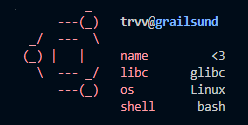

# cetch

`cetch` is an (esoteric) application for UNIX systems. It emulates the
functionality of the popular "fetch" type of tools with suckless-esque
source-based configuration as opposed to itself being a script or being
configurable through a script. Originally written soley to piss of xent,
it has since been used as a farm for Hacktoberfest pull requests and a
test-bed for stupid ideas to use in C code.

I know you'll love using it, because I hated every minute of writing it,
and yes, so did woosh. If you'd like to contribute, go ahead, I will
pull any changes as long as they aren't profoundly stupid. Heck, I won't
even test them first.
